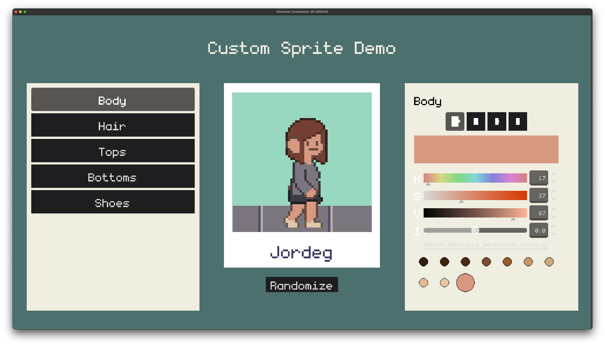
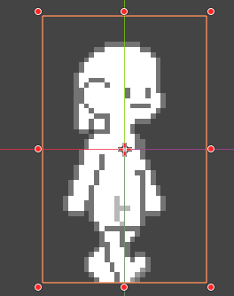
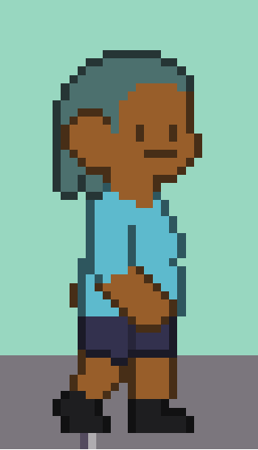

# Custom Character 2D

A Godot 4 addon for building layered, customizable 2D characters with texture swapping, color modulation, and AnimationPlayer sync.



---

## Features

- Layered sprites with per-layer texture swapping
- Color modulation via grayscale textures
- AnimationPlayer sync across all layers simultaneously
- Signal-driven UI — connect `texture_changed` / `color_changed` to anything
- Serializable configuration snapshots via `CSLayerConfig`

---

## Installation

1. Copy this folder into your project's `addons/` directory
2. Open **Project → Project Settings → Plugins** and enable **Custom Character 2D**
3. The three node types (`CSSprite`, `CSLayer`, `CSSpriteProperty`) are now available in the **Add Node** dialog

---

## Quick Start

### 1. Build the Scene Tree

Minimum viable scene:

```
CSSprite                    ← root node
  ├── CSSpriteProperty      (e.g. "Body")
  ├── CSSpriteProperty      (e.g. "Hair")
  ├── CSLayer               (e.g. body layer)
  ├── CSLayer               (e.g. hair layer)
  └── AnimationPlayer
```


---

### 2. Configure CSSpriteProperty

In the inspector for each `CSSpriteProperty` node:

- Set `ui_name` — the human-readable label shown in your UI
- Assign `texture_previews` — thumbnails used by picker UIs (optional)
- Assign a `color_presets` (`CS2DColorPalette` resource) for preset color swatches (optional)

---

### 3. Configure CSLayer

In the inspector for each `CSLayer` node:

- Add textures to the `textures` array — one texture per variant
- Set `texture_constraint` → drag in the `CSSpriteProperty` that controls which variant is shown
- Set `color_constraint` → drag in the `CSSpriteProperty` that controls the color tint
- Optionally set `visibility_constraint` + fill the `visibility` array (one `bool` per variant index) to show/hide this layer based on another property's selected variant. This is a fallback in case you have multiple textures for a single area. Like adding a texture for shorts when everything was pants.


---

### 4. Set Up Animation

- Add an `AnimationPlayer` node as a child of `CSSprite`
- On `CSSprite`, set `animation_player_path` to `NodePath("AnimationPlayer")`
- Animate `CSSprite/frame` — all layers stay in sync automatically
- Trigger animations from code:

```gdscript
custom_sprite.play_animation("walk")
```

---

### 5. Drive Changes via Signals

`CSSpriteProperty` emits signals whenever its state changes — connect these from UI, game logic, or network code:

- `texture_changed(value: int)` — fires when the selected variant changes
- `color_changed(color: Color)` — fires when the color changes

To change the character from code, set properties directly:

```gdscript
body_property.texture_index = 2
hair_property.color = Color.RED
hair_property.randomize()   # picks a random variant + color from presets
```

---

## Textures

Layers use **grayscale source textures** for color modulation:

- Pure **white** pixels take the full tint color
- Pure **black** pixels stay black regardless of tint
- Mid-grey pixels blend proportionally (Use this for outlines relevant to the fill color)

This lets a single texture work for any color variant without needing separate artwork per color.




---

## Node Reference

### CSSprite

The root node. Owns the layer configuration and drives the AnimationPlayer.

| Property                | Type                 | Description                                          |
| ----------------------- | -------------------- | ---------------------------------------------------- |
| `animation_player_path` | NodePath             | Path to AnimationPlayer (relative to this node)      |
| `h_frames`              | int                  | Horizontal spritesheet frames — synced to all layers |
| `v_frames`              | int                  | Vertical spritesheet frames — synced to all layers   |
| `frame`                 | int                  | Current frame — synced to all layers                 |
| `layer_config`          | Array[CSLayerConfig] | Saved configuration snapshot                         |

**Methods:**

- `play_animation(name: String)` — plays a named animation on the linked AnimationPlayer
- `set_layers(config: Array[CSLayerConfig])` — restores a saved configuration
- `set_layer(layer, config)` — updates a single layer

**Signals:**

- `layers_ready()` — emitted after all `CSLayer` children are initialized; wait for this before reading or writing layer state at runtime

---

### CSSpriteProperty

Holds the current texture variant index and color for one customizable aspect of the character (e.g. hair style, skin tone).

| Property           | Type             | Description                                             |
| ------------------ | ---------------- | ------------------------------------------------------- |
| `ui_name`          | String           | Human-readable name (useful for UI labels)              |
| `texture_index`    | int              | Currently selected variant (auto-clamps to valid range) |
| `color`            | Color            | Currently selected color                                |
| `texture_previews` | Array[Texture2D] | Optional thumbnails for picker UIs                      |
| `color_presets`    | CS2DColorPalette | Optional preset color swatches                          |

**Methods:**

- `randomize()` — picks a random variant index and color from presets

**Signals:**

- `texture_changed(value: int)` — fires when `texture_index` changes
- `color_changed(color: Color)` — fires when `color` changes

---

### CSLayer

A single sprite layer. Reads its variant and tint from the `CSSpriteProperty` nodes wired into its constraints.

| Property                | Type             | Description                                                    |
| ----------------------- | ---------------- | -------------------------------------------------------------- |
| `title`                 | String           | Identifier — matches `CSLayerConfig.name`                      |
| `textures`              | Array[Texture2D] | Texture variants (one per index)                               |
| `texture_constraint`    | CSSpriteProperty | Controls which variant is displayed                            |
| `color_constraint`      | CSSpriteProperty | Controls the color tint                                        |
| `visibility_constraint` | CSSpriteProperty | Gates visibility based on another property                     |
| `visibility`            | Array[bool]      | One entry per `visibility_constraint` index — `true` = visible |

---

### CSLayerConfig (Resource)

A serializable snapshot of one layer's state. Fields: `name`, `variant_index`, `color`. Use with `CSSprite.set_layers()` to restore a saved character look.

---

## License

(leave as-is / author fills in)
